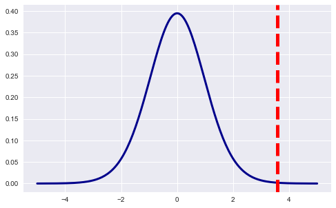

# Conducting T-Tests

## Introduction
Just as you previously used the t distribution to provide confidence intervals on estimating the population mean, you can also use similar methods to test whether two populations are different, statistically speaking. To do this, you can use a t-test.

## Objectives
You will be able to:

* Perform a complete one sample t-test analysis and describe the results


## Hypothesis testing using Frequentist methods

In frequentist hypothesis testing, you construct a test statistic from the measured data and use the value of that statistic to decide whether to accept or reject the null hypothesis. 
The test statistic is a lower dimensional summary of the data but still maintains the discriminatory power necessary to make the decision whether or not to reject the null hypothesis.


[Here](https://hackaday.com/2017/12/01/statistics-and-hacking-an-introduction-to-hypothesis-testing/) is an excellent introduction to hypothesis testing. 

There are 6 steps when completing an experiment are:

1) Set up a null and alternative hypotheses

2) Choose a significance level 

3) Calculate your test statistic

4) Calculate probability value or find rejection region

5) Make a decision about the null hypothesis


Now, you're going to go through these 5 steps in more detail.

Let's begin with a sample experiment here.

### Sample question: 

>** *"Acme Ltd. wants to improve sales performance. Past sales data indicate that the average sale was 100 dollars per transaction. After training the sales force, recent sales data (from a random sample of 25 salesmen) is shown below:"* **

       
      [122.09, 100.64, 125.77, 120.32, 118.25,  
        96.47, 111.4 ,  80.66, 110.77, 111.14, 
        102.9, 114.54,  88.09,  98.59,  87.07, 
       110.43, 101.9 , 123.89,  97.03, 116.23, 
        108.3, 112.82, 119.57, 131.38, 128.39]

> **Did the training work?

Before we dive into the experimental process, we need to make sure some assumptions that are based on our sampling techniques are satisfied.


#### Assumptions for the test (your data should meet these requirements for the test to be valid):

* **Data is independent**

Independence means the value of one observation does not influence or affect the value of other observations. Independent data items are not connected with one another in any way (unless you account for it in your model). This includes the observations in both the “between” and “within” groups of your sample. Non-independent observations introduce bias and can make your statistical test give too many false positives.  

* **Data is collected randomly** 

A sample is random when each data point in your population has an equal chance of being included in the sample; therefore, the selection of any individual observation happens by chance, rather than by choice. This reduces the chance that differences in materials or conditions strongly bias results. Random samples are more likely to be representative of the population; therefore, you can be more confident with your statistical inferences with a random sample. 

* **The data is approximately normally distributed**

The normal distribution assumption is that the sampling distribution of the mean is normal. That is, if you took a sample, calculated its mean, and then you took another (independent) sample (from the same population) and got its mean (and repeated this an infinite number of times), then the distribution of the values that you wrote down would always be a perfect bell curve. This is the principle behind the Central Limit Theorem, and it is this idea  that allows us to perform hypothesis tests. While maybe surprising, this assumption turns out to be relatively uncontroversial, at least when each of the samples is large, such as N ≥ 30. 


In order to show a significant increase in the sales performance, we need to calculate the following values:

* **The population mean ($\mu$).** Given as 100 (from past data).
* **The sample mean ($\bar{x}$).** Calculate from the sample data
* **The sample standard deviation ($s$).** Calculate from sample data
* **Number of observations($n$).** 25 as given in the question. This can also be calculated from the sample data.
* **Degrees of Freedom($df$).** Calculate from the sample as df = total no. of observations - 1


```python
## Import the packages
import numpy as np
from scipy import stats 
import math

# For visualizing distributions - optional 
import seaborn as sns
import matplotlib.pyplot as plt
sample = np.array([122.09, 100.64, 125.77, 120.32, 118.25,  96.47, 111.4 , 80.66,
       110.77, 111.14, 102.9 , 114.54,  88.09,  98.59,  87.07, 110.43,
       101.9 , 123.89,  97.03, 116.23, 108.3 , 112.82, 119.57, 131.38,
       128.39])


# Population mean (μ)
mu = 100 

# Sample mean (x̄) using NumPy mean()
x_bar = sample.mean()

# Sample Stadrad Deviation (sigma) using Numpy
sigma = np.std(sample,ddof=1)

# Sample size (n)
n = len(sample)

# Degrees of Freedom
df = n-1

# Difference in sample mean 
diff = x_bar - mu


# Print the findings
print ('The sample contains', n, 'observations, having a mean of', x_bar, "and a standard deviation (sigma) = ", sigma, 
       ", with", df, 'degrees of freedom. The difference between sample and population means is:', diff)

# The sample contains 25 observations, having a mean of 109.5456 
# and a standard deviation (sigma) =  13.069276668584225 , 
# with 24 degrees of freedom. 
# The difference between sample and population means is: 9.54
```

    The sample contains 25 observations, having a mean of 109.5456 and a standard deviation (sigma) =  13.338774643871902 , with 24 degrees of freedom. The difference between sample and population means is: 9.545599999999993


```python
sns.set(color_codes=True)
sns.set(rc={'figure.figsize':(12,10)})
sns.distplot(sample)
```

    /Users/forest.polchow/anaconda3/lib/python3.6/site-packages/matplotlib/axes/_axes.py:6462: UserWarning: The 'normed' kwarg is deprecated, and has been replaced by the 'density' kwarg.
      warnings.warn("The 'normed' kwarg is deprecated, and has been "


    <matplotlib.axes._subplots.AxesSubplot at 0x10d01e9e8>


### Step 1: Write your null and alternative hypothesis statements

As you are trying to monitor a change in the sales performance after the training, the null-hypothesis addresses the fact that there is no change and sales performance before and after the training is exactly the same. 

**$H_{0}$: *The null hypothesis is that there is no difference in sales, so:* **

> $H_{0}: \mu$ = $100.

    
This is the one that we are testing. Our alternate hypothesis should address the expected change in the sales performance i.e. the sales performance has increased and the mean of sales post-training is greater than 100. 

**$H_{1}$: *The alternative hypothesis is that there is a change i.e. the mean sales increased.* **

> $H_{1}: \mu$ > $100.


### Step 2: Choose a Significance Levels (Alpha)

The significance level, also denoted as alpha or `α`, is the probability of rejecting the null hypothesis when it is true. For example, a significance level of 0.05 indicates a 5% risk of concluding that a difference exists when there is no actual difference. Look at the following graphs for a better understanding: 


In the graph above, the two shaded areas are equidistant from the null hypothesis value and each area has a probability of 0.025, for a total of 0.05. In statistics, we call these shaded areas the critical regions for a two-tailed test. If the population mean is 260, you’d expect to obtain a sample mean that falls in the critical region 5% of the time. The critical region defines how far away our sample statistic must be from the null hypothesis value before we can say it is unusual enough to reject the null hypothesis.

Our sample mean (330.6) falls within the critical region, which indicates it is statistically significant at the 0.05 level.

You can also see if it is statistically significant using the other common significance level of 0.01.


The two shaded areas each have a probability of 0.005, the two of which add up to a total probability of 0.01. This time the sample mean does not fall within the critical region, and you fail to reject the null hypothesis. This comparison shows why you need to choose your significance level before you begin your study. It protects you from choosing a significance level because it conveniently gives you significant results!

Using the graph, data scientists are able to determine that their results are statistically significant at the 0.05 level without using a P value. However, when you use the numeric output produced by statistical software, you’ll need to compare the P value to your significance level to make this determination.

For this experiment, we are going to use an $\alpha$ of 0.05.

#### Review: P values: 
P values are the probability of obtaining an effect at least as extreme as the one in your sample data, assuming the truth of the null hypothesis. Let's look at the following graph for a better understanding.


To graph the P value, you need to determine the distance between the sample mean and the null hypothesis value (330.6 - 260 = 70.6). Next, you can graph the probability of obtaining a sample mean that is at least as extreme in both tails of the distribution (260 +/- 70.6).

In the graph above, the two shaded areas each have a probability of 0.01556, for a total probability 0.03112. This probability represents the likelihood of obtaining a sample mean that is at least as extreme as our sample mean in both tails of the distribution if the population mean is 260. That’s our P value!

When a P value is less than or equal to the significance level, you reject the null hypothesis. If you take the P value for our example and compare it to the common significance levels, it matches the previous graphical results. The P value of 0.03112 is statistically significant at an alpha level of 0.05, but not at the 0.01 level.

If you stick to a significance level of 0.05, you can conclude that the average energy cost for the population is greater than 260.

[Here's](https://www.khanacademy.org/math/ap-statistics/tests-significance-ap/idea-significance-tests/v/p-values-and-significance-tests) a video that explains this idea in detail. 

## t-test
t-tests (also called Student’s t-test) are very practical hypotheses tests that can be employed to compare two averages (means) to know if they are different from each other. You should run a t-test when you either:
* don’t know the population standard deviation 
* you have a small sample size    

Like a z-test, the t-test also tells you how significant the differences are i.e. it lets you know if those differences could have happened by chance. In this lesson, you will get an introduction to t-tests, in particular, the 1-sample t-test. There are additional kinds of t-tests including 2-sample t-test and paired t-test. This lesson will show you the mathematical calculations behind a 1-sample t-test as well as how to perform a t-test in Python using NumPy and SciPy. 

Detailed descriptions of hypothesis testing with t-tests can be found [here](http://www.mas.ncl.ac.uk/~njnsm/medfac/docs/ttest) and [here](http://blog.minitab.com/blog/adventures-in-statistics-2/understanding-t-tests-t-values-and-t-distributions)


### One Sample t-test

The 1-sample t-test is a statistical procedure used to determine whether a sample of observations could have been generated by a process with a specific mean. The one sample t-test compares the mean of your sample data to a known value. For example, you might want to know how your sample mean compares to the population mean.  Here is a quick example of a scenario where a 1-sample t-test could be applied. 

*Suppose you are interested in determining whether a bakery production line produces cakes with the weight of exactly 2 pounds. To test this hypothesis, you could collect a sample of cakes from the production line, measure their weights, and compare the sample with a value of 2 using a one-sample t-test.* 

We will discuss this process in detail in the following description. First, we must ensure that our experiment settings meet the necessary pre-requisites for conducting the t-test as given below:

At this point, you should have some idea of the difference between the sample and the population mean. To review, there is a null hypothesis that states there's no increase in sales performance and an alternate hypothesis that states that there is an increase in sales performance after the training session.

The first step for stating these findings would be to assume that the null hypothesis is true. That means the mean of the sample and population are the same. What we want to know is, given that our null hypothesis is true, how rare is the data we're seeing?

We're going to solve this problem by two methods, and you'll see that they agree.

### Step 3: Calculate the t-statistic

The sample looks like a nicely shaped normal distribution. After fulfilling the three requirements for a t-test mentioned above i.e. normality, independence, and randomness, we are ready to calculate our t statistic using the formula for one-sample t-test given as:

# $$t = \frac{\bar{x}-\mu}{\frac{s}{\sqrt{n}}}$$
 
> **Exercise:** Using the formula given above, calculate the t-value in Python:


```python
# Calculate Sigma
t = (x_bar -  mu)/(sigma/np.sqrt(n))
t
# 3.578139767278185
```


    3.578139767278185


## Step 4: Calculate probability value (p-value), or find rejection region
> Note that a positive t value indicates that the sample mean is greater than the population mean and vice versa. This means that the sample's average sales performance post-training is greater than average population sales performance. 

This sounds like good news, **BUT** is the increase high enough to reject the null hypothesis and accept that there is a significant increase in the mean of post training sales perfromance, or is it just by chance. Lets have a look at the t-distribution table to calculate our critical t_value, also, how to calculate the critical t value in python. 

Now, try visualizing the calculated t-statistic with a PDF.


```python
# generate points on the x axis between -5 and 5:
xs = np.linspace(-5, 5, 200)

# use stats.t.pdf to get values on the probability density function for the t-distribution
# the second argument is the degrees of freedom
ys = stats.t.pdf(xs, df, 0, 1)

# initialize a matplotlib "figure"
fig = plt.figure(figsize=(8,5))

# get the current "axis" out of the figure
ax = fig.gca()

# plot the lines using matplotlib's plot function:
ax.plot(xs, ys, linewidth=3, color='darkblue')

# plot a vertical line for our measured difference in rates t-statistic
ax.axvline(t, color='red', linestyle='--', lw=5)

plt.show()
```





The critical value approach involves determining "likely" or "unlikely", by determining whether or not the observed test statistic is more extreme than would be expected if the null hypothesis were true. This involves comparing the observed test statistic to some cutoff value, called the **"critical value"**. 
>If the test statistic is more extreme than the critical value, then the null hypothesis is rejected in favor of the alternative hypothesis. If the test statistic is not as extreme as the critical value, then the null hypothesis is not rejected.


You need two values to find this:

The **alpha level**: given as 5% in the question.

**Degrees of freedom**, which is the number of items in the sample (n) minus 1: 25 – 1 = 24.


You use a one-tailed t-test towards the positive (right side of the t-distribution) to identify an increase in the sales performance. 

Look up 24 degrees of freedom in the left column and a p value of 0.05 (from 5% alpha level - 95% confidence level) in the top row. The intersection is `1.711`. This is our one-sample critical t-value.

For the Null hypothesis to be true, what this critical value means is that we would expect most values to fall under 1.711. If our calculated t-value (from Step 4) falls within this range, the null hypothesis is likely true and we fail to reject the null hypothesis.

This value can also be calculated in Python using Scipy.stats module using ppf() (Percent Point Function) as `scipy.stats.t.ppf(1-alpha, df)`. 

Ley's calculate the critical t using this formula and confirm our earlier findings. 


```python
# Calculate critical t value
t_crit = np.round(stats.t.ppf(1 - 0.05, df=24),3)
t_crit
# 1.711
```


    1.711


As you can see , the critical value returned from the function (rounded off 2 two decimal places) is same as one we found the in t-distribution table i.e. 1.711. 

Using the the [t-distribution calculator](http://www.statdistributions.com/t/), and providing the set p-value, t-value and identifying the type of t-test, we get the following graph:


### Step 5: Compare t-value with critical t-value to accept or reject the Null hypothesis.

Any t value which is greater than 1.711 will fall into the shaded region in the above figure. t-values greater than 1.711 would reflect an "extreme" result and can be used to reject the null hypothesis. 

Your calculated t-value, known as the t-statistic is 3.65, which greater than 1.711 and hence our results can be called "statistically significant" and will allow us to reject the null hypothesis and with 95% confidence state that: 

*We are 95% sure that the mean sales performance post training is higher than the population mean prior to training.*

**NOTE:** This calculation can also be performed using the `ttest_1samp`  function in `SciPy.stats` indicated here: 

>**scipy.stats.ttest_1samp(a, popmean, axis=0, nan_policy='propagate')**


Where a is the sample mean ($\bar{x}$) and popmean ($\mu$) is the population mean. This function returns the t-value and p-value for the sample. Here, you are using a one-tailed t-test as you are looking for an increase in sales performance.


```python
results = stats.ttest_1samp(a= sample, popmean= mu)         
print ("The t-value for sample is", round(results[0], 2), "and the p-value is", np.round((results[1]), 4))
#  Print results
# The t-value for sample is 3.58 and the p-value is 0.0015
```

    The t-value for sample is 3.58 and the p-value is 0.0015


We can use our null and alternate hypotheses defined earlier to state the results from our findings. 


```python
if (results[0]>t_crit) and (results[1]<0.05):
    print ("Null hypothesis rejected. Results are statistically significant with t-value =", 
           round(results[0], 2), "and p-value =", np.round((results[1]), 4))
else:
    print ("Null hypothesis is Accepted")
```

    Null hypothesis rejected. Results are statistically significant with t-value = 3.58 and p-value = 0.0015


## Summary

In this lesson, you saw a quick introduction to hypothesis testing using frequentists methods with t-values and p-values. You saw how a one sample t-test can be applied to contexts where the population mean is unknown and you have a limited amount of sample data. You looked at all the stages required for such hypothesis testing with a description of steps and also, how to perform these functions in Python. The lesson also briefly explains the comparison of using p-value for statistical significance vs. effect sizes. 


